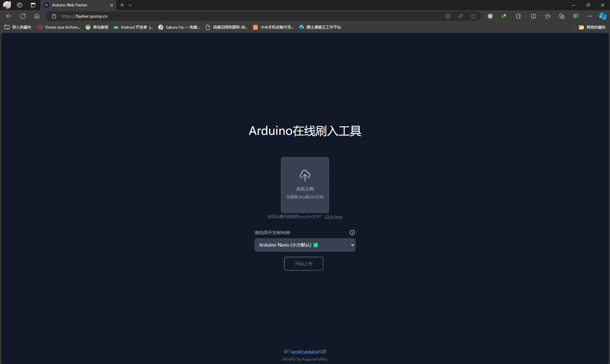
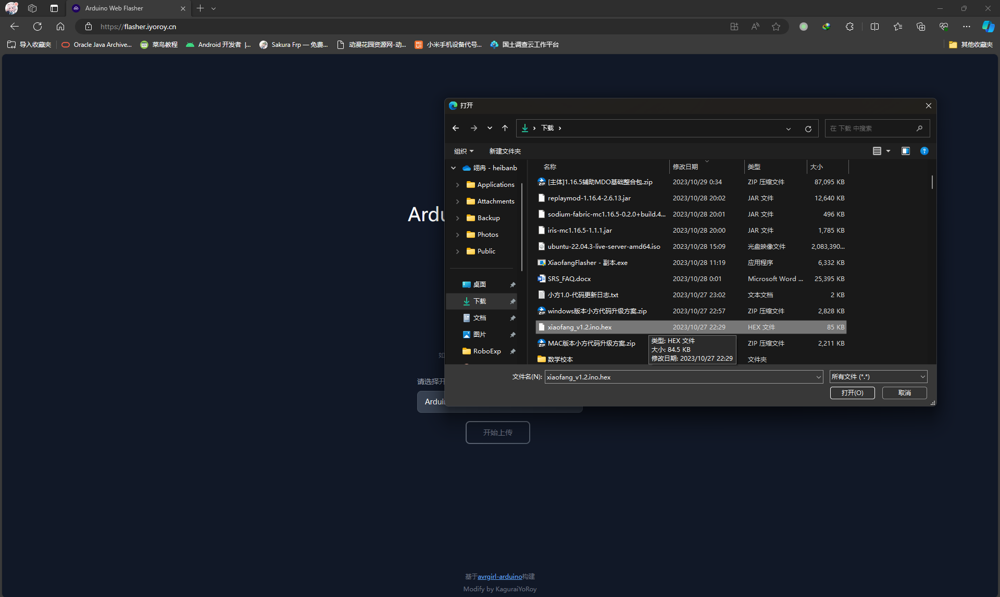
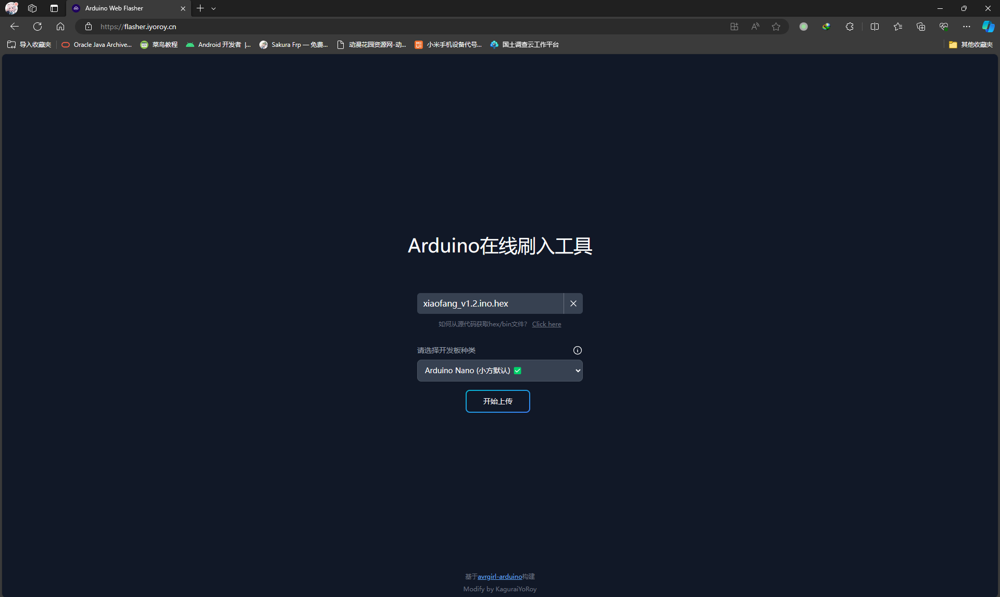
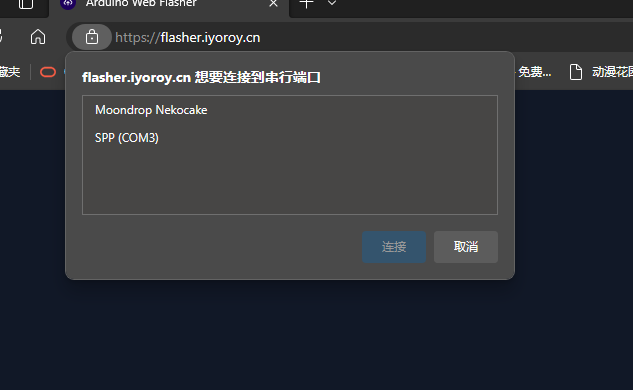
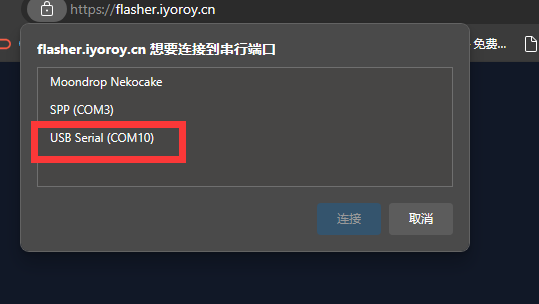
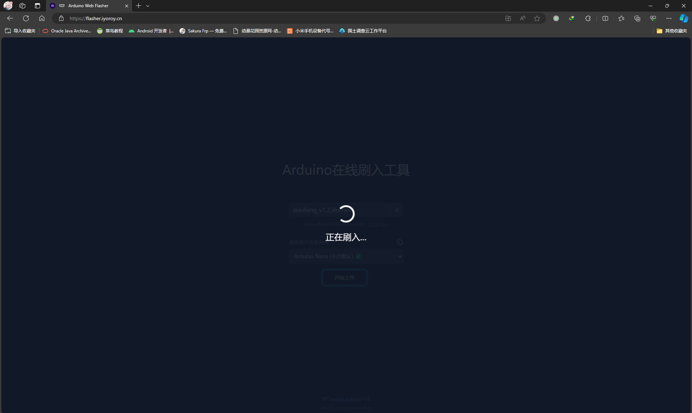
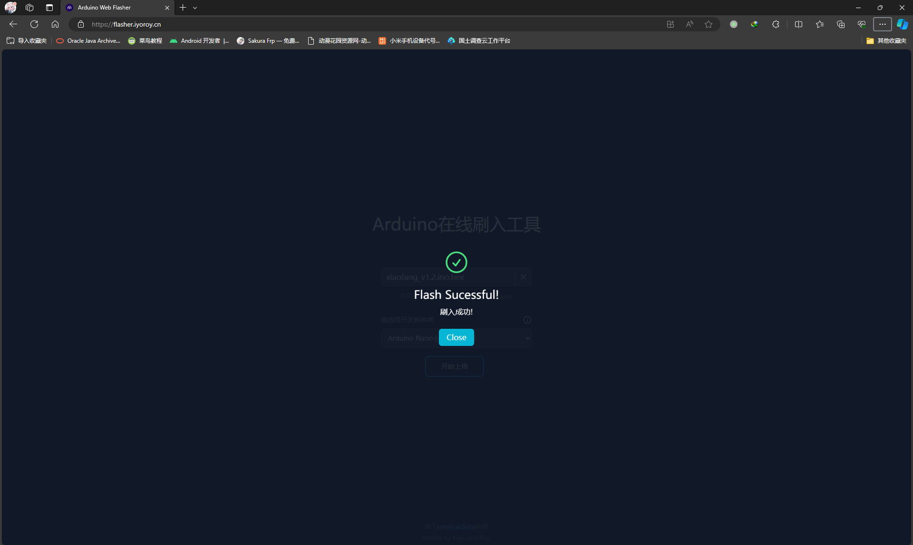

# Arduino Web Flasher
## 简介
[跳转](https://flasher.iyoroy.cn)  
为[小方](https://www.bilibili.com/video/BV18h4y1m7tG)摸的一个在线刷arduino nano的网站  
基于[Andreas-Froyland/arduino-web-flasher](https://github.com/Andreas-Froyland/arduino-web-flasher)汉化修改。  
经过测试兼容的浏览器：  

| Platform | Browser | Version |
| :-----: | :-----: | :-----: |
| Windows | Chrome | 89-121 |
| Windows | Edge | 89-118 |
| Windows | Opera | 76-103 |  

## 使用（以Microsoft Edge为例）
### 准备材料
* 小方更新HEX文件
* 小方
* Type-C数据线
### 操作
先不连接小方，打开[网页](https://flasher.iyoroy.cn)，如图：
  
选择 **点击上传** 并选择更新HEX文件：
  
  
  
点击 **开始上传** ，浏览器会弹出如下窗口：
  
此时插入小方，会发现多出了一个串口设备：
  
选择那个多出来的串口并确定，浏览器将自动开始刷入：
  
  

出现Successful之类的字样后便可拔下小方，更新完成